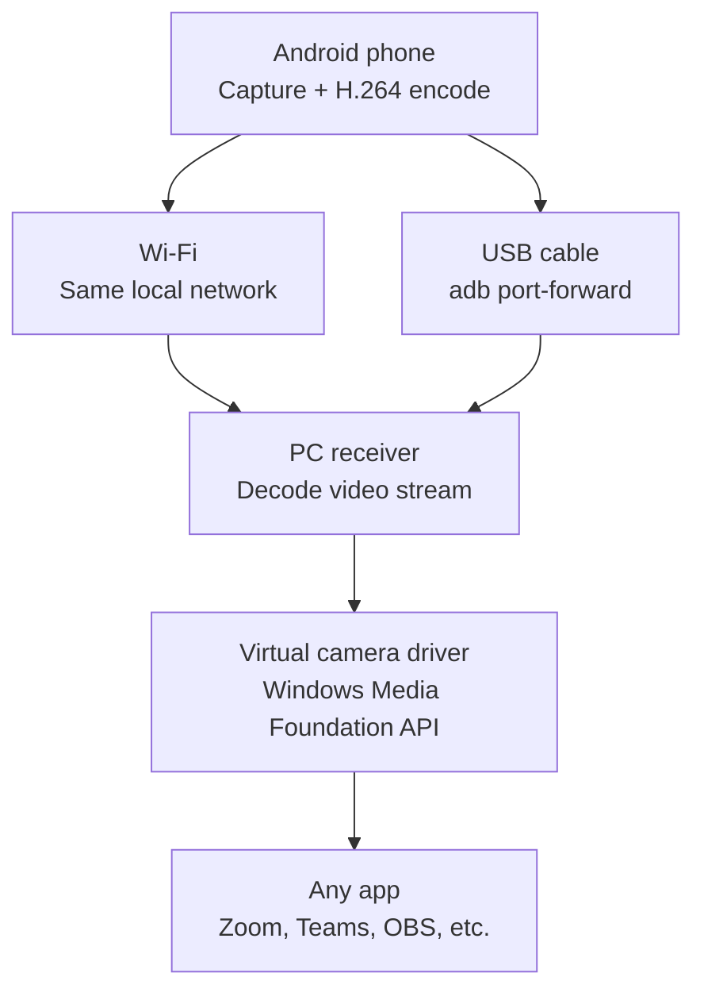

# Architecture

## Overview

The system has four moving pieces: the Android capture app, a transport layer that works over Wi-Fi or USB, a Windows receiver, and a virtual camera driver that exposes the stream system-wide.

## Components

### Android app
Captures frames with Camera2 (or CameraX on top of it) and hardware-encodes them to H.264 via `MediaCodec`. Runs a small local server that speaks the wire protocol described in [protocol.md](protocol.md).

### Transport
One protocol, two paths:
- **Wi-Fi** — phone and PC on the same LAN. PC connects directly to the phone's local IP and port.
- **USB** — `adb forward tcp:<port> tcp:<port>` tunnels the exact same server to `localhost` on the PC. No second protocol to build or maintain; USB debugging is the only extra requirement on the phone.

### PC receiver
Connects over whichever path is active, decodes the incoming H.264 stream, and hands decoded frames to the virtual camera.

### Virtual camera driver
Registers a Windows camera device using the Media Foundation Virtual Camera API (`MFCreateVirtualCamera`), so the feed shows up as a normal camera choice in any app — no bundled viewer required.

## Key decisions

**Windows 11 only for v1.** The Media Foundation virtual camera API needs build 22000+. Supporting Windows 10 means also building the older DirectShow filter path — real extra effort, no functional gain for this phase. Revisit if Windows 10 reach turns out to matter.

**H.264 throughout.** Broad hardware encode/decode support on both Android and Windows; no re-encoding at any hop.

**TCP for control, UDP for video.** Control messages (pairing, start/stop, capability negotiation) need reliability; video frames favor low latency over guaranteed delivery — a dropped frame is cheaper than a stalled stream.

**adb forward over USB tethering.** Tethering would also work, but it's a second network path to test and support. Tunneling the same server through `adb forward` keeps the transport logic to one implementation.
